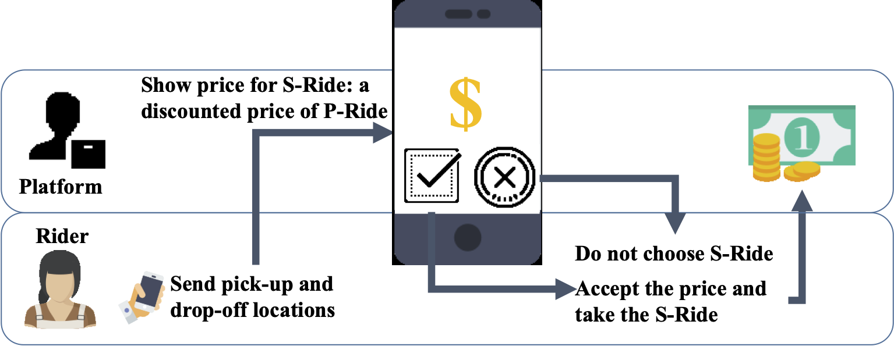
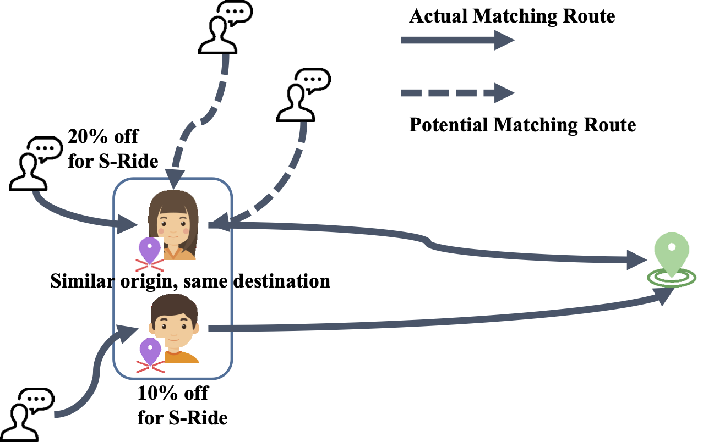
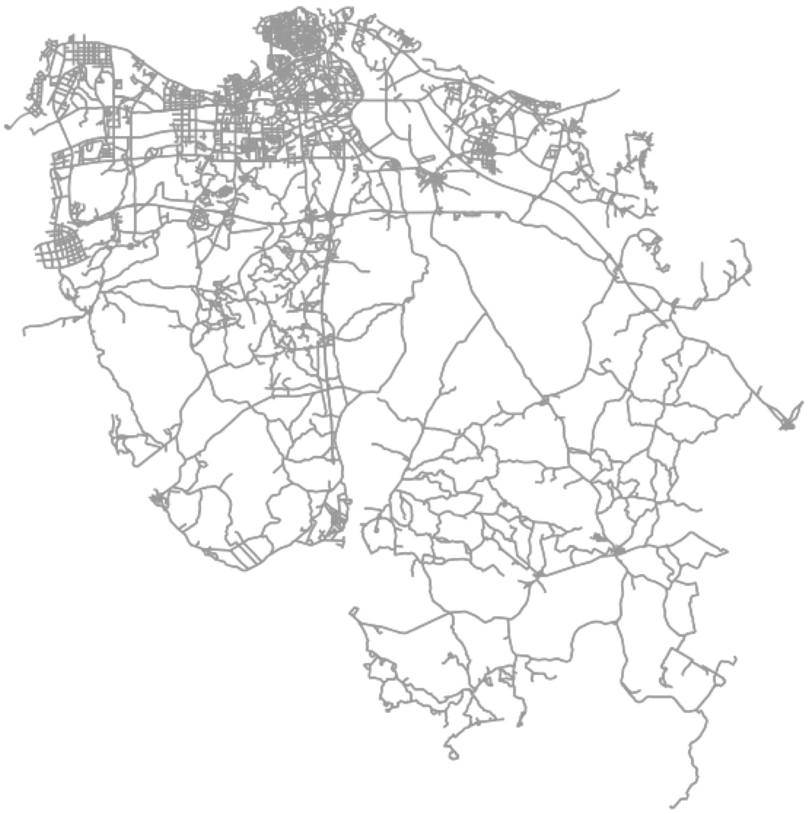

# Implementation of OnFairRP for Online Fair Ride-Sharing Pricing
<p align="center">
    
</p>
<b><p align="center">
    Figure 1. Process of ride-sharing pricing
</p></b>
<br>
<p align="center">
    
</p>
<b><p align="center">
    Figure 2. Motivating example of pricing without fairness
</p></b>

## Overview
* Ride-sharing is a transportation mode in which individual travelers share a vehicle for a trip. <br>
* OnFairRP is an online fair ride-sharing pricing algorithm <br>
* This project includes a ride-sharing simulator, the implementation of OnFair and other pricing schemes for comparison. <br>

## Fairness
The motivating example in Figure 2 captures the real fairness issue in ride-sharing pricing. Though Alice and Bob have similar origins and same destination, Alice will be charged less since Alice’s neighborhood has more potential passengers to share the ride, which is unfair to Bob. 

To deal with this issue, we consider the notion of **individual fairness**. Specifically, if two riders are similar (e.g., in terms of origin, destination, and departure time), they should receive similar discounts. Our algorithm, OnFairRP, guarantees individual fairness among riders in an online way. That is, for two riders arriving at different times, the difference between the discount of the latter rider and the one of any previous rider is bounded by $$K$$ times the similarity of the two riders.

## Dependencies
* scipy
* munkres
* networkx
* [osmnx](https://osmnx.readthedocs.io/en/stable/): e.g., to get a networkx graph of Haikou, China:
    ```python
    import osmnx as ox
    G = ox.graph_from_place('Haikou, Hainan, China', network_type='drive')
    ox.plot_graph(G, node_size=0)
    ```
    <p align="center">
        
    </p>
* To install the dependent packages:
    ```bash
    pip install -r requirements.txt
    ```

## Data Source
* Real-world data of ride request from [DiDi Chuxing GAIA Initiative](https://gaia.didichuxing.com).

## Usage
#### To price for ride requests using OnFair algorithm:
* Run with default settings:
    ```bash
    python main_pricing.py
    ```
* Run with parameters specified:
    ```bash
    python main_pricing.py --a 0.99 --K 0.16 --omega 0.5 --threshold 1.0
    ```
#### To simulate the ride-sharing process with the ride requests and their corresponding price:
* Run with price computed by default settings:
    ```bash
    python main.py
    ```
* Run with price computed with parameters specified:
    ```bash
    python main.py --a 0.99 --K 0.16 --omega 0.5
    ```
* Run with price computed by a certain scheme:
    ```bash
    python main.py --scheme OnFair
    ```
#### To run with a set of values of a parameter for every scheme:
* Pricing
    ```bash
    nohup bash a.sh >log.out 2>&1 & 
    nohup bash omega.sh >log.out 2>&1 &
    nohup bash K.sh >log.out 2>&1 &
    ```
* Ride-sharing simulation
    ```bash
    nohup bash cp_a.sh >log.out 2>&1 & 
    nohup bash cp_omega.sh >log.out 2>&1 &
    nohup bash cp_K.sh >log.out 2>&1 &
    ```
#### To get more details of arguments of `main.py` or `main_pricing.py`:
```bash
python main.py --help
```


